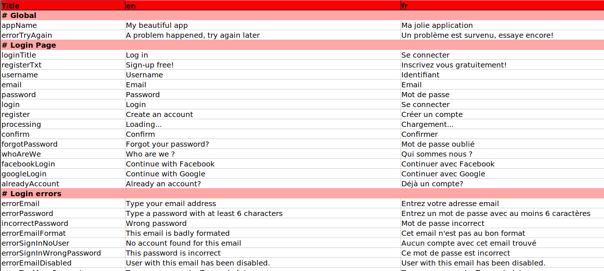
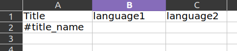
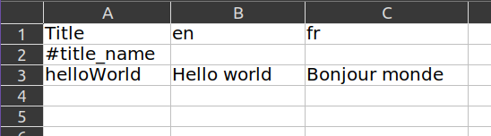
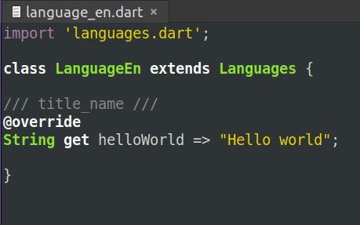
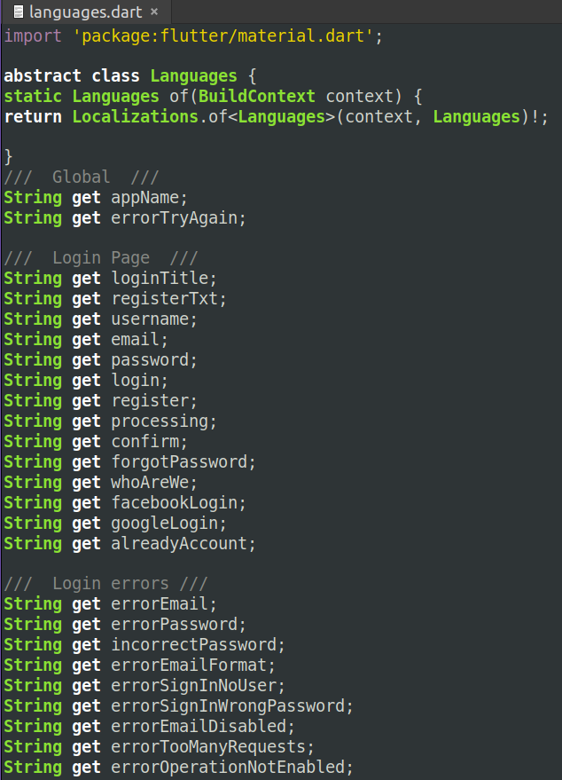
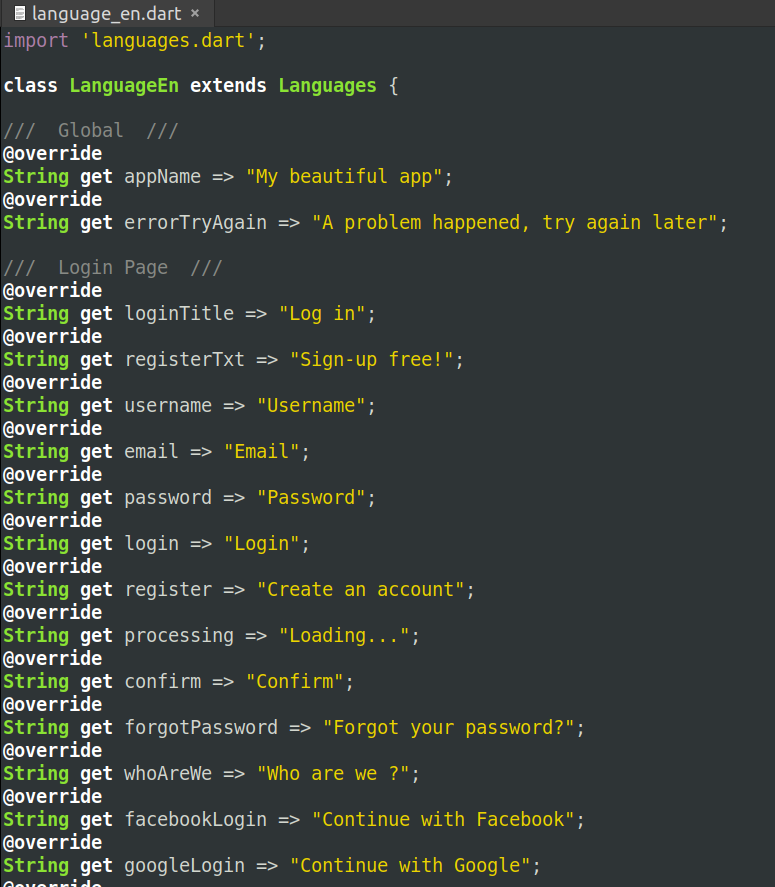

# (utils) Flutter languages strings manager
Python script generating languages.dart from xlsx file (or the other way around) to manage string in differents languages for a flutter app with LocalizationsDelegate

# How to use ?

Create strings.xlsx with Column headers [Title, LanguageCode1, ..., LanguageCodeN]

The second row needs to be #your_category_name

Then the variable name and its translations

Run 'generate_languages_files.py' in the same folder to generate one languages.dart and the languages_LanguageCodeN.dart for each language

To do it the other way around, first edit 'generate_strings_xlsx.py' to modify the line 'codes = ["en", "fr"]' with what you need (it needs to be the same as the column header names)

 

